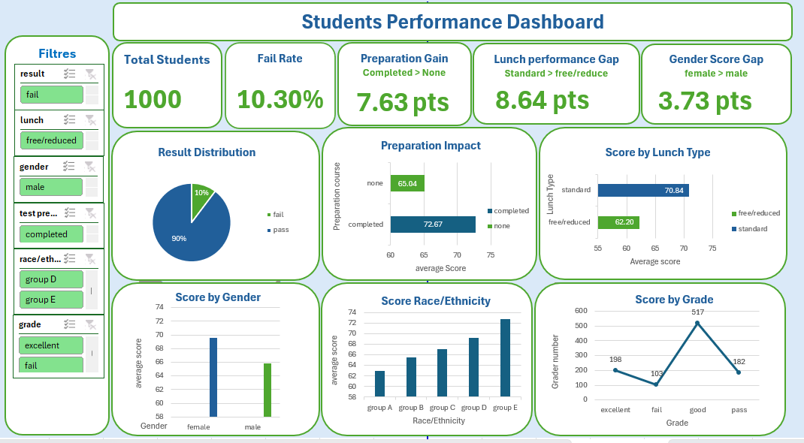

# Excel Students Performance Analysis

Analyse des performances scolaires de 1000 étudiants à partir du dataset **StudentsPerformance**, réalisée intégralement sous Excel (nettoyage de données, tableaux croisés dynamiques, dashboard interactif).

## Aperçu du Dashboard



## Objectif

Identifier les facteurs qui influencent les résultats scolaires (genre, préparation aux tests, type de repas, niveau d'éducation des parents) et les synthétiser dans un dashboard exploitable.

## Structure du dataset

| Colonne | Description |
|---|---|
| gender | Genre de l'étudiant |
| race/ethnicity | Groupe d'appartenance |
| parental level of education | Niveau d'éducation des parents |
| lunch | Type de repas (standard / free-reduced) |
| test preparation course | Suivi ou non du cours de préparation |
| math score, reading score, writing score | Scores obtenus |
| average_score, result, grade | Colonnes calculées |

## Méthodologie

1. Nettoyage des données brutes (feuille `Données corrigées`)
2. Calcul de colonnes dérivées : score moyen, résultat, grade
3. Construction de tableaux croisés dynamiques (feuille `Analyse (TCD)`)
4. Synthèse visuelle dans un dashboard interactif (feuille `Dashboard`)

## Résultats clés

- Le cours de préparation augmente la moyenne de **65,0 à 72,7**
- Un repas standard est associé à une moyenne plus élevée (**70,8 vs 62,2**)
- Les enfants de parents ayant un master obtiennent les meilleurs résultats (**73,6**)

## Fichiers du dépôt

Le dépôt contient le classeur Excel, le dataset source, le dossier des visuels et ce README :

- `students_performance_analysis.xlsx` - classeur Excel complet
- `StudentsPerformance.csv` - dataset source
- `assets/dashboard.png` - capture du dashboard
- `README.md` - présentation du projet

```
excel-students-performance-analysis/
├── assets/
│   └── dashboard.png
├── students_performance_analysis.xlsx
├── StudentsPerformance.csv
└── README.md
```

## Outils utilisés

Microsoft Excel : tableaux croisés dynamiques, formules de calcul, mise en forme conditionnelle, graphiques dynamiques

## Auteur

Richard GNALOU